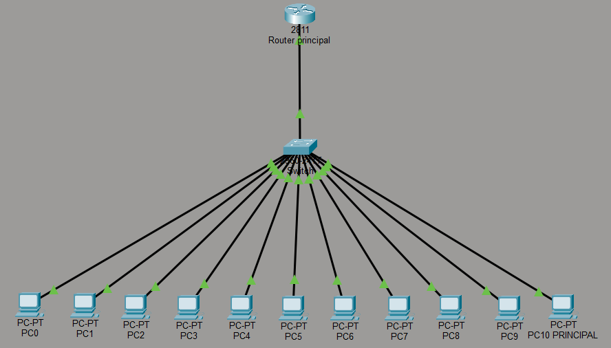

# Landing Page - Proyecto de Red LAN

## 📋 Descripción

Landing page profesional que documenta el proceso completo de diseño, implementación y configuración de una red LAN en un aula de cómputo. Proyecto académico demostrando conocimientos en cableado estructurado y configuración de redes.

## ✨ Características

- **Diseño Moderno y Técnico**: Estética minimalista y profesional tipo portafolio de ingeniería
- **Totalmente Responsivo**: Se adapta a todos los tamaños de pantalla
- **Animaciones Suaves**: Micro-animaciones que mejoran la experiencia del usuario
- **Documentación Completa**: 9 secciones detallando todo el proceso

## 📂 Estructura del Proyecto

```
lan-network-landing/
├── index.html          # Estructura HTML principal
├── styles.css          # Sistema de diseño y estilos
├── script.js           # Funcionalidad JavaScript
└── README.md           # Este archivo
```

## 🎨 Secciones

1. **Hero Section**: Título principal y estadísticas clave (11 equipos, topología estrella, estándar T568B)
2. **Contexto del Proyecto**: Explicación del objetivo y alcance
3. **Diseño de la Red**: Diagramas lógicos y físicos
4. **Armado Paso a Paso**: Timeline del proceso de instalación
5. **Terminación y Estándares**: Proceso de terminación de cables según T568B
6. **Configuración de Red**: Detalles de configuración IPv4
7. **Resultados y Validación**: Checklist de funcionalidades validadas
8. **Conclusión**: Cierre técnico y académico
9. **Footer**: Información institucional

## 🚀 Cómo Usar

1. Abre `index.html` en tu navegador web
2. Personaliza el footer con la información de los alumnos, carrera, materia, docente e institución
3. Reemplaza las imágenes placeholder con fotos reales del proyecto:
   - Diagrama de Packet Tracer en la sección hero
   - Fotos del aula antes de la instalación
   - Fotos del proceso de instalación
   - Capturas de pantalla de configuración de red

## 📝 Personalización

### Información del Footer

Edita las siguientes líneas en `index.html` (líneas 241-261):

```html
<div class="footer-item">
    <strong>Alumnos:</strong>
    <span>[Nombres de los alumnos]</span>
</div>
<!-- ... más campos -->
```

### Agregar Imágenes Reales

Para reemplazar las imágenes placeholder, puedes:

1. **Opción fácil**: Modificar el archivo `script.js` para cambiar las funciones que generan placeholders
2. **Opción recomendada**: Crear una carpeta `images/` y actualizar el JavaScript para cargar imágenes reales

Ejemplo en `script.js`:
```javascript
heroContainer.innerHTML = '';
```

## 🎨 Paleta de Colores

- **Primario**: #3b82f6 (Azul)
- **Acento**: #8b5cf6 (Púrpura)
- **Éxito**: #10b981 (Verde)
- **Texto**: #1e293b (Gris oscuro)
- **Fondo**: #ffffff (Blanco)

## 🌐 Tecnologías

- HTML5 semántico
- CSS3 con variables CSS y Grid/Flexbox
- JavaScript vanilla (sin dependencias)
- Google Fonts (Inter)
- SVG para iconos y diagramas

## 📱 Responsive Design

La página es completamente responsive con breakpoints en:
- Desktop: > 1024px
- Tablet: 768px - 1024px
- Mobile: < 768px

## ⚡ Rendimiento

- Sin dependencias externas (excepto fuente)
- CSS optimizado con variables
- JavaScript modular y eficiente
- Imágenes SVG escalables

## 📄 Licencia

Proyecto académico - Libre para uso educativo

---

**Nota**: Esta landing page está diseñada específicamente para documentación técnica académica. El diseño prioriza claridad, profesionalismo y presentación ordenada de información técnica.
